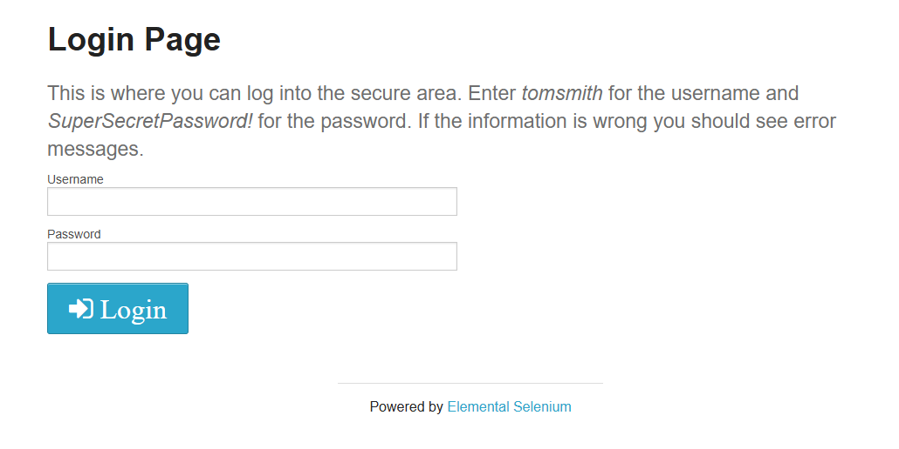
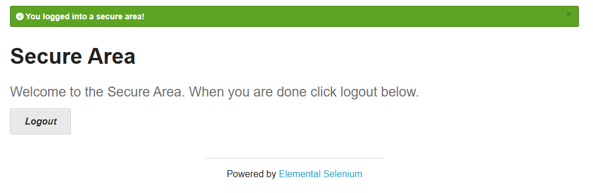
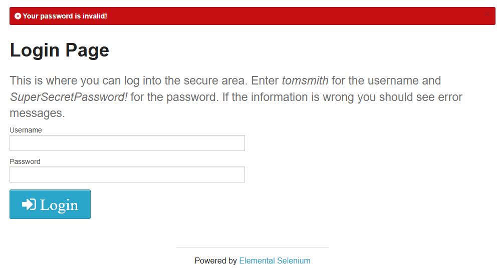

# Web Test Automation — Python & Selenium

Web test automation project using Python, Selenium WebDriver and unittest, covering login, form validation and error handling.

## Technologies

- Python
- Selenium WebDriver
- unittest
- WebDriver Manager
- Git
- GitHub

## Project Objective

The objective of this project is to practice and demonstrate foundational knowledge in web test automation, application behavior validation, and software quality practices.

It focuses on using Python and Selenium WebDriver to interact with web pages, validate form inputs, and verify that web interfaces handle valid and invalid inputs correctly.

## Test Website

The automated tests in this project were developed using [The Internet](https://the-internet.herokuapp.com/login), a web application commonly used for practicing web automation and testing.

The login page was used to validate successful and unsuccessful login attempts, form interactions, and error handling.

## Testing Approach

The project uses Selenium WebDriver to automate interactions with the web browser and unittest to organize and execute the automated tests.

The tests are executed in Microsoft Edge and use WebDriver Manager to handle the Edge WebDriver setup automatically.

The login page is tested through positive and negative scenarios, validating whether the application displays the expected response for valid credentials, invalid passwords, and invalid usernames.

The project also uses a simple Page Object structure to separate page interactions from test logic and improve code organization.

## Test Scenarios

- Automated navigation to the login page
- Interaction with username and password fields
- Submission of login credentials
- Validation of successful login with valid credentials
- Validation of login failure with an invalid password
- Validation of login failure with an invalid username
- Verification of success and error messages

## Test Coverage

The current test suite covers the following login scenarios:

| Scenario | Expected Result |
|---|---|
| Valid username and password | Login succeeds and the secure area message is displayed |
| Valid username and invalid password | Login is rejected and the password error message is displayed |
| Invalid username and valid password | Login is rejected and the username error message is displayed |

## Application Preview

### Login Page



### Successful Login



### Invalid Password



## Project Structure

```text
automacao-selenium/
├── docs/
│   └── images/
│       ├── login-page.png
│       ├── login-success.png
│       └── login-error.png
├── pages/
│   ├── base_page.py
│   └── login_page.py
├── tests/
│   └── test_login.py
├── .gitignore
├── .gitattributes
└── README.md
```

## Getting Started

### Prerequisites

- Python 3.x
- Microsoft Edge
- Internet connection
  
### Clone the repository

```bash
git clone https://github.com/naxt-dev/automacao-selenium.git
cd automacao-selenium
```

### Create a virtual environment

```bash
python -m venv venv
```

### Activate the virtual environment

**Windows (PowerShell):**

```powershell
.\venv\Scripts\activate
```

**Windows (Command Prompt):**

```cmd
venv\Scripts\activate.bat
```

**Linux / macOS:**

```bash
source venv/bin/activate
```

### Install dependencies

```bash
pip install selenium webdriver-manager
```

### Run the tests

Run the test suite using unittest test discovery:

```bash
python -m unittest discover -s tests -v
```

## What I Learned

- Web test automation with Selenium WebDriver
- Automated interaction with web elements
- Browser automation using Microsoft Edge
- Test organization using unittest
- Basic Page Object structure for test automation
- WebDriver management using WebDriver Manager
- Validation of expected application behaviors
- Identification of incorrect application responses
- Basic software quality and testing practices
- Structuring automated test scenarios

## Future Improvements

- Expanding test coverage across more application features
- Adding more negative and edge-case scenarios
- Improving test organization and code reusability
- Adding test execution reports
- Integrating automated tests into CI/CD pipelines
- Exploring other testing frameworks and automation tools
